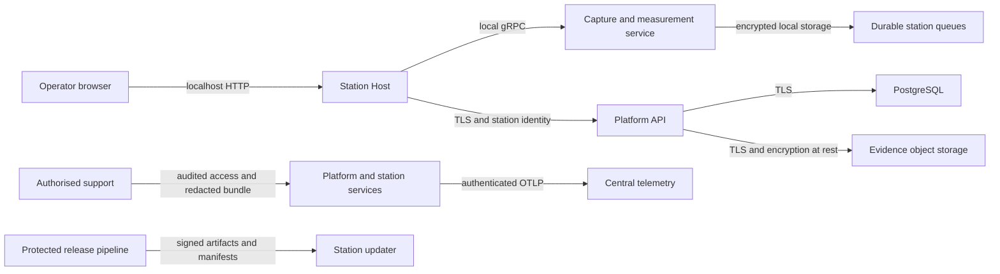

# SpecProof Production Threat Model

**Status:** Initial Phase 8 baseline
**Last reviewed:** 2026-08-16T08:16:19Z
**Review cadence:** Every production release and after material architecture changes

## Scope

This threat model covers the production station, capture and measurement processes,
operator and administrator web applications, platform API, PostgreSQL metadata, object
storage, telemetry pipeline, installers, update channel, release artifacts, and support
workflows. Camera firmware, factory physical security, and cloud-provider controls remain
shared or external responsibilities and require deployment-specific review.

## Protected Assets

- Garment images, depth data, point clouds, meshes, and capture packages.
- Tech packs, graded specifications, production orders, and supplier identifiers.
- Inspection decisions, measurements, evidence records, signatures, and audit history.
- Tenant, station, operator, certificate, signing-key, and update identities.
- Offline queues, calibration records, model/ruleset versions, and release artifacts.
- Database backups, object-storage backups, logs, traces, support bundles, and crash dumps.

## Security Principals

- Operators and reviewers acting through browser applications.
- Tenant administrators and SpecProof support personnel.
- Station Host, capture service, measurement pipeline, and platform services.
- CI runners, release automation, package registries, and signing services.
- PostgreSQL, MinIO-compatible storage, telemetry services, and backup targets.
- External identity providers, certificate authorities, and qualified hardware services.

## Trust Boundaries

Remote traffic must cross authenticated TLS boundaries. Local station traffic is limited to
loopback or operating-system service boundaries. Release artifacts cross from protected CI
and signing infrastructure into an untrusted distribution channel and must therefore be
verified before installation.

## Threat Register

| ID | Threat | Primary controls | Required Phase 8 evidence |
| --- | --- | --- | --- |
| TM-01 | Cross-tenant data access | Authoritative tenant claims, query filters, tenant-bound writes, negative tests | Authentication/authorisation audit and tenant matrix |
| TM-02 | Stolen or forged station identity | Per-station certificates, chain/EKU/expiry checks, rotation, revocation | mTLS integration and rotation tests |
| TM-03 | Credential or signing-key disclosure | External secret stores, startup validation, managed signing service, redaction | Secret scan and support-bundle tests |
| TM-04 | Capture or evidence disclosure at rest | Authenticated encryption, protected keys, object-storage encryption, least privilege | Encryption round-trip, tamper, and rotation tests |
| TM-05 | Evidence or audit tampering | Canonical hashes, signatures, append-only records, independent verification | Independent evidence verifier result |
| TM-06 | Malicious or vulnerable dependency | Lock files, SBOMs, provenance, vulnerability and license gates | Reviewed SBOM and zero unapproved high/critical findings |
| TM-07 | Compromised installer or update | Signed manifest, artifact hash, compatibility checks, atomic activation, rollback | Signature, upgrade, rollback, and offline-update tests |
| TM-08 | Queue loss or duplicate submission | Durable acknowledgement, immutable hashes, idempotency, restart recovery | Offline and chaos test evidence |
| TM-09 | Denial of service or resource exhaustion | Rate limits, bounded inputs, queue limits, health checks, alerts | Load, latency, storage, and alert tests |
| TM-10 | Sensitive data in logs or support bundles | Structured allow-listed diagnostics and deterministic redaction | Secret corpus and archive inspection tests |
| TM-11 | Excessive service privileges | Dedicated service identities, OS sandboxing, non-root containers, read-only filesystems | Installer/container policy tests |
| TM-12 | Unqualified firmware or model change | Compatibility manifest, staged rollout, audit events, blocked automatic firmware changes | Release-manifest and rollout tests |

## Security Invariants

1. An authenticated tenant cannot read or write another tenant's records.
2. A station identity can report or submit only for its bound station and tenant.
3. Production startup fails closed when identity, TLS, encryption, or signing configuration
   is absent or uses a documented development fallback.
4. No operator acknowledgement occurs before capture and inspection results are durably
   written locally.
5. Evidence verification requires no mutable inspection state and detects any changed byte.
6. Installers and updates execute only after manifest, checksum, signature, and compatibility
   verification.
7. Secrets, private keys, bearer tokens, and database credentials never enter source,
   release artifacts, telemetry, or support bundles.

## Deferred and External Risks

- Independent penetration testing and cryptographic design review require external assessors.
- Production signing requires organisation-controlled certificates or protected signing
  services; developer test keys are not production evidence.
- Hardware theft, camera substitution, USB attacks, TPM availability, factory networking,
  and physical tamper controls require site and hardware qualification.
- Privacy impact and retention decisions require the data controller and privacy owner.
- Legal non-repudiation is not claimed without specialist legal and cryptographic review.

## Review Procedure

Each release review must confirm architecture changes, new data flows, new dependencies,
changed trust boundaries, vulnerability exceptions, penetration-test findings, incident
lessons, and deployment-specific controls. Findings receive an owner, severity, UTC due date,
and immutable release evidence reference. A critical unresolved finding forces `NO_GO`.
